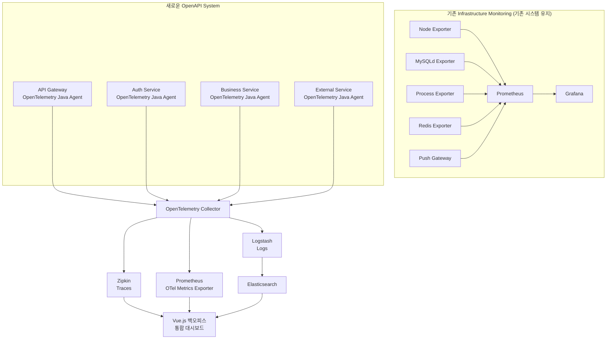

## 들어가며

Spring Boot 기반 멀티모듈 시스템을 운영하면서 기존 Prometheus + Grafana 모니터링으로는 서비스 간 트랜잭션 흐름 추적에 한계를 느끼게 되었습니다. 특히 OpenAPI 시스템 확장 과정에서 모듈 간 호출 관계와 장애 지점 파악의 어려움이 대두되었고, 이를 해결하기 위해 OpenTelemetry 기반 관측성 시스템을 도입했습니다.

본 글에서는 기존 모니터링 스택을 유지하면서 새로운 트레이싱 기능을 추가하는 과정과, ELK 스택에서 Zipkin + Prometheus 조합으로 변경하게 된 기술적 의사결정 과정을 공유합니다.

---

## 기존 시스템 현황과 한계점 분석

### 기존 모니터링 아키텍처

우리 시스템은 인프라 레벨에서 다양한 Exporter를 활용한 Prometheus + Grafana 조합으로 구성되어 있었습니다:


> 기존 시스템은 인프라 레벨에서의 메트릭 수집과 시각화에는 효과적이었지만, 애플리케이션 레벨의 비즈니스 로직 추적에는 한계가 있었습니다.
{: .prompt-info }

**기존 시스템의 강점**:
- **인프라 중심 모니터링**: Node Exporter, MySQLd Exporter, Redis Exporter 등을 통한 체계적인 시스템 리소스 모니터링
- **애플리케이션 무침투성**: Spring Boot 애플리케이션에 별도 계측 코드 추가 없이 외부에서 메트릭 수집
- **Grafana 대시보드**: 다양한 익스포터 데이터를 통합한 직관적인 모니터링 환경
- **안정적인 운영**: Process Exporter를 통한 애플리케이션 프로세스 상태 모니터링

**한계점**:
- **애플리케이션 레벨 가시성 부족**: 인프라 메트릭만으로는 비즈니스 로직 수준의 성능 병목 파악 어려움
- **서비스 간 트랜잭션 추적 불가**: API Gateway → Auth Service → Business Service → External API 호출 체인에서 어느 구간에서 지연이 발생하는지 파악 불가
- **요청별 상관관계 추적 한계**: 동일한 사용자 요청이 여러 서비스를 거치면서 발생하는 로그와 메트릭의 연관성 파악 어려움
- **비즈니스 메트릭 부재**: HTTP 상태 코드, 응답 시간 등 기술적 메트릭은 있지만 실제 비즈니스 성공/실패율 등의 지표 부족

### OpenAPI 시스템 확장 요구사항

새로 구축하게 된 OpenAPI 시스템은 기존 인프라 중심 모니터링과는 완전히 다른 접근이 필요했습니다:

- **애플리케이션 중심 관측성**: API Gateway → Auth Service → Business Service → External API 호출 체인의 각 구간별 상세 추적 필요
- **높은 가용성 요구**: OpenAPI 장애가 곧 고객사 서비스 중단으로 이어지는 크리티컬한 시스템
- **통합 대시보드 요구사항**: 기존 백오피스 시스템에서 바로 모니터링 정보를 확인하고 싶은 요구
- **관리포인트 최소화**: Grafana 같은 별도 도구 추가로 인한 관리 복잡도 증가 회피

> **핵심 결정사항**: "인프라는 정상인데 API가 느린 이유를 모르겠다"는 상황을 해결하기 위해 애플리케이션 레벨에서 모든 것을 관측하기로 결정했습니다.
{: .prompt-warning }

---

## OpenTelemetry 도입 설계와 아키텍처 구성

### 확장된 모니터링 아키텍처 설계

OpenAPI 시스템에서는 기존 인프라 익스포터 방식을 **완전히 탈피**하고 OpenTelemetry 기반 애플리케이션 중심 관측성으로 전환했습니다:



> OpenAPI 시스템에서는 **인프라 익스포터를 완전히 제거**하고 애플리케이션 레벨에서 모든 관측 데이터를 수집하도록 전환했습니다.
{: .prompt-info }

### OpenTelemetry 이중 계측 전략

효과적인 트레이싱을 위해 자동 계측과 수동 계측을 병행했습니다:

#### 자동 계측 (OpenTelemetry Java Agent)

1. HTTP 클라이언트/서버 요청 자동 추적
2. 데이터베이스 쿼리 (JPA, MyBatis) 자동 계측
3. Redis, Kafka 등 미들웨어 호출 자동 추적

#### 수동 계측 (OpenTelemetry Spring Starter)

1. 비즈니스 로직 구간별 상세 추적
2. 사용자 정의 속성 추가 (사용자 ID, 요청 타입 등)
3. 에러 상황별 세분화된 추적

### 실제 적용 사례

**Spring Boot 애플리케이션 설정**:

```yaml
# application.yml
management:
  endpoints:
    web:
      exposure:
        include: health, prometheus, metrics
  tracing:
    sampling:
      probability: 0.1  # 10% 샘플링

otel:
  exporter:
    otlp:
      endpoint: http://otel-collector:4317
  resource:
    attributes:
      service.name: api-gateway-service
      service.version: 1.2.0
      environment: production
```
{: file='src/main/resources/application.yml'}

**비즈니스 로직 트레이싱**:

```java
@RestController
@RequiredArgsConstructor
public class OpenApiController {
    
    private final Tracer tracer = GlobalOpenTelemetry.getTracer("openapi-service");
    private final ExternalApiService externalApiService;
    
    @PostMapping("/api/v1/process")
    public ResponseEntity<ApiResponse> processRequest(@RequestBody ApiRequest request) {
        Span span = tracer.spanBuilder("openapi.process.request")
                .setAttribute("api.client.id", request.getClientId())
                .setAttribute("api.request.type", request.getType())
                .startSpan();
                
        try (Scope scope = span.makeCurrent()) {
            // 1. 요청 검증
            validateRequest(request);
            
            // 2. 외부 API 호출
            Span externalSpan = tracer.spanBuilder("external.api.call")
                    .setAttribute("external.endpoint", request.getTargetEndpoint())
                    .startSpan();
                    
            try (Scope externalScope = externalSpan.makeCurrent()) {
                ApiResponse response = externalApiService.callExternalApi(request);
                externalSpan.setAttribute("external.response.status", response.getStatus());
                return ResponseEntity.ok(response);
            } finally {
                externalSpan.end();
            }
            
        } catch (Exception e) {
            span.recordException(e);
            span.setStatus(StatusCode.ERROR, e.getMessage());
            throw e;
        } finally {
            span.end();
        }
    }
}
```
{: file='src/main/java/com/example/controller/OpenApiController.java'}

---

## 기술 스택 변경 여정: ELK에서 Zipkin + Prometheus로

### 초기 계획: OpenTelemetry + ELK 스택

처음에는 다음과 같은 ELK 기반 아키텍처를 계획했습니다:


**ELK 스택 선택 이유**:
- 대용량 로그 데이터 처리에 최적화된 Elasticsearch
- Kibana의 강력한 시각화 및 대시보드 기능
- 로그와 트레이싱 데이터의 통합 분석 가능

### ELK 스택 운영 중 발견된 문제점

> 실제 운영 과정에서 다음과 같은 한계점들이 발견되었습니다.
{: .prompt-warning }

#### 1. Kibana 보안 이슈
- 기본 설정으로는 접근 제어가 미흡
- X-Pack Security 도입 시 라이선스 비용 발생
- 사내 보안 정책과의 충돌

#### 2. Vue.js 대시보드 통합 어려움
- Kibana 데이터를 외부 애플리케이션에서 직접 활용하기 복잡
- 커스텀 대시보드 구축 시 Kibana API의 제약사항
- 기존 Vue.js 기반 관리 시스템과의 일관성 부족

#### 3. Prometheus와의 이원화 문제
- 기존 Prometheus 메트릭과 ELK 트레이싱 데이터가 분리
- 메트릭과 트레이스 상관관계 분석의 어려움
- 운영팀의 도구 학습 부담 증가

### 최종 선택: Zipkin + Prometheus + Logstash 조합

여러 POC(Proof of Concept)를 거쳐 다음 조합으로 최종 결정했습니다:

| 기능 | 기존 ELK | 변경 후 |
|:-----|:---------|:--------|
| 트레이싱 | Kibana | **Zipkin** |
| 메트릭 | 별도 Prometheus | **Prometheus** (유지) |
| 로그 수집 | Logstash | **Logstash** (유지) |
| 로그 저장 | Elasticsearch | **Elasticsearch** (유지) |

**변경 결정의 핵심 요인**:

#### Zipkin 선택 이유
- 가벼운 트레이싱 UI 제공으로 빠른 장애 분석 가능
- REST API 지원으로 Vue.js 대시보드와 쉬운 통합
- 단일 컨테이너 운영으로 운영 복잡도 최소화
- 메모리 사용량이 Jaeger 대비 약 40% 적음

#### Vue.js 백오피스 통합 선택 이유
- **관리포인트 최소화**: Grafana 추가 시 또 다른 시스템 관리 부담 발생
- **사용자 경험 일관성**: 기존 백오피스에서 OpenAPI 관리와 모니터링을 동시에 처리
- **빠른 장애 대응**: 백오피스 작업 중 실시간으로 API 상태 확인 가능
- **접근 권한 통합**: 별도 Grafana 계정 관리 없이 기존 백오피스 권한 체계 활용

#### Prometheus 역할 변경
- **기존**: 다양한 인프라 익스포터들로부터 직접 메트릭 수집
- **변경 후**: OpenTelemetry Collector의 Prometheus Exporter를 통해 애플리케이션 메트릭만 수집
- **유지 이유**: 기존 PromQL 경험과 메트릭 쿼리 노하우 재활용 가능
- **활용 방법**: Vue.js에서 Prometheus REST API를 통해 직접 메트릭 데이터 조회

#### Logstash 활용 이유
- 기존 Elasticsearch 인프라 활용
- 다양한 로그 포맷 파싱 및 변환 기능
- OpenTelemetry 데이터의 로그 형태 변환 처리

---

## 구현 과정과 기술적 도전

### OpenTelemetry Collector 설정

트레이싱, 메트릭, 로그를 각각 적절한 백엔드로 라우팅하는 Collector 구성:

```yaml
# otel-collector-config.yaml
receivers:
  otlp:
    protocols:
      grpc:
        endpoint: 0.0.0.0:4317
      http:
        endpoint: 0.0.0.0:4318

processors:
  batch:
    timeout: 1s
    send_batch_size: 1024
  
  resource:
    attributes:
      - key: environment
        value: production
        action: upsert
      - key: cluster
        value: openapi-cluster
        action: upsert

exporters:
  # Zipkin으로 트레이싱 데이터 전송
  zipkin:
    endpoint: http://zipkin:9411/api/v2/spans
    
  # Prometheus로 메트릭 전송
  prometheus:
    endpoint: "0.0.0.0:8889"
    namespace: "openapi"
    
  # Logstash로 로그 데이터 전송
  logging:
    loglevel: info

service:
  pipelines:
    traces:
      receivers: [otlp]
      processors: [resource, batch]
      exporters: [zipkin]
      
    metrics:
      receivers: [otlp] 
      processors: [resource, batch]
      exporters: [prometheus]
      
    logs:
      receivers: [otlp]
      processors: [resource, batch]
      exporters: [logging]
```
{: file='docker/otel-collector-config.yaml'}

### Vue.js 백오피스 통합 대시보드

기존 백오피스 시스템에 모니터링 기능을 직접 통합하여 관리포인트를 최소화했습니다:

```javascript
// 백오피스에 통합된 모니터링 서비스
export class IntegratedMonitoringService {
  constructor() {
    this.zipkinBaseUrl = process.env.VUE_APP_ZIPKIN_URL;
    this.prometheusBaseUrl = process.env.VUE_APP_PROMETHEUS_URL;
    this.elasticsearchBaseUrl = process.env.VUE_APP_ES_URL;
  }
  
  // OpenAPI 서비스별 실시간 상태 확인 (백오피스 메인 화면용)
  async getOpenAPIServiceStatus() {
    const services = ['api-gateway', 'auth-service', 'business-service'];
    const statusData = {};
    
    for (const service of services) {
      // Prometheus에서 각 서비스의 에러율과 응답시간 조회
      const errorRateQuery = `rate(http_requests_total{job="${service}",status=~"5.."}[5m])`;
      const latencyQuery = `histogram_quantile(0.95, rate(http_request_duration_seconds_bucket{job="${service}"}[5m]))`;
      
      const [errorRate, latency] = await Promise.all([
        this.queryPrometheus(errorRateQuery),
        this.queryPrometheus(latencyQuery)
      ]);
      
      statusData[service] = {
        errorRate: errorRate.data.result[0]?.value[1] || 0,
        p95Latency: latency.data.result[0]?.value[1] || 0,
        status: this.determineServiceStatus(errorRate, latency)
      };
    }
    
    return statusData;
  }
  
  // 특정 API 엔드포인트의 상세 트레이스 분석 (OpenAPI 관리 화면용)
  async getAPIEndpointAnalysis(endpoint, timeRange = '1h') {
    // Zipkin에서 해당 엔드포인트의 최근 트레이스 조회
    const traces = await this.getRecentTraces('api-gateway', 100);
    const endpointTraces = traces.filter(trace => 
      trace.some(span => span.tags['http.url']?.includes(endpoint))
    );
    
    // 성능 분석 데이터 생성
    const analysis = {
      totalRequests: endpointTraces.length,
      avgDuration: this.calculateAverageDuration(endpointTraces),
      errorCount: endpointTraces.filter(trace => this.hasError(trace)).length,
      slowestTrace: this.findSlowestTrace(endpointTraces),
      bottleneckServices: this.identifyBottlenecks(endpointTraces)
    };
    
    return analysis;
  }
  
  async queryPrometheus(query) {
    const response = await fetch(
      `${this.prometheusBaseUrl}/api/v1/query?query=${encodeURIComponent(query)}`
    );
    return response.json();
  }
}
```
{: file='src/services/IntegratedMonitoringService.js'}

**백오피스 컴포넌트 통합 예시**:

```vue
<template>
  <div class="openapi-management">
    <!-- 기존 OpenAPI 관리 기능 -->
    <div class="api-management-section">
      <h2>OpenAPI 엔드포인트 관리</h2>
      <!-- API 등록/수정/삭제 기능 -->
    </div>
    
    <!-- 통합된 모니터링 대시보드 -->
    <div class="monitoring-section">
      <h2>실시간 API 상태</h2>
      <div class="service-status-grid">
        <div v-for="(status, service) in serviceStatus" :key="service" 
             :class="`status-card ${status.status}`">
          <h3>{{ service }}</h3>
          <p>에러율: {{ (status.errorRate * 100).toFixed(2) }}%</p>
          <p>P95 지연시간: {{ status.p95Latency }}ms</p>
          <button @click="openTraceDetail(service)">상세 분석</button>
        </div>
      </div>
    </div>
  </div>
</template>

<script>
import { IntegratedMonitoringService } from '@/services/IntegratedMonitoringService';

export default {
  name: 'OpenAPIManagement',
  data() {
    return {
      serviceStatus: {},
      monitoring: new IntegratedMonitoringService()
    };
  },
  async mounted() {
    // 기존 OpenAPI 관리 데이터 로드
    await this.loadAPIEndpoints();
    
    // 실시간 모니터링 데이터 로드
    await this.loadServiceStatus();
    
    // 30초마다 상태 갱신
    setInterval(this.loadServiceStatus, 30000);
  },
  methods: {
    async loadServiceStatus() {
      this.serviceStatus = await this.monitoring.getOpenAPIServiceStatus();
    },
    
    async openTraceDetail(service) {
      // 모달이나 새 탭에서 해당 서비스의 상세 트레이스 분석 화면 오픈
      this.$router.push(`/monitoring/trace/${service}`);
    }
  }
};
</script>
```
{: file='src/components/OpenAPIManagement.vue'}

### 주요 기술적 도전과 해결책

#### 도전 1: 높은 트래픽에서의 성능 영향

> 초기 100% 트레이싱으로 인한 성능 저하 문제가 발생했습니다.
{: .prompt-danger }

**문제**: 응답 시간 5-10% 증가, CPU 사용률 15% 상승

**해결**: 적응형 샘플링 도입

```java
// 적응형 샘플링 설정
@Configuration
public class TracingConfiguration {
    
    @Bean
    public SdkTracerProvider tracerProvider() {
        return SdkTracerProvider.builder()
                .addSpanProcessor(BatchSpanProcessor.builder(
                        OtlpGrpcSpanExporter.builder()
                                .setEndpoint("http://otel-collector:4317")
                                .build())
                        .setMaxExportBatchSize(512)
                        .setExportTimeout(Duration.ofSeconds(2))
                        .build())
                .setSampler(TraceIdRatioBasedSampler.create(0.1)) // 10% 샘플링
                .build();
    }
}
```
{: file='src/main/java/com/example/config/TracingConfiguration.java'}

#### 도전 2: 비동기 처리에서의 TraceId 전파 문제

**문제**: Spring의 `@Async` 메서드에서 트레이스 컨텍스트 손실

**해결**: TraceableExecutorService 래핑

```java
@Configuration
@EnableAsync
public class AsyncConfiguration implements AsyncConfigurer {
    
    @Override
    public Executor getAsyncExecutor() {
        ThreadPoolTaskExecutor executor = new ThreadPoolTaskExecutor();
        executor.setCorePoolSize(10);
        executor.setMaxPoolSize(20);
        executor.setQueueCapacity(100);
        executor.setThreadNamePrefix("async-");
        executor.initialize();
        
        // OpenTelemetry 컨텍스트 전파를 위한 래핑
        return Context.taskWrapping(executor);
    }
}
```
{: file='src/main/java/com/example/config/AsyncConfiguration.java'}

#### 도전 3: 대용량 로그 데이터 처리

**문제**: 일일 수십 GB의 로그 데이터로 인한 Elasticsearch 부하

**해결**: Logstash 파이프라인 최적화와 인덱스 생명주기 관리

```ruby
# logstash.conf
input {
  beats {
    port => 5044
  }
}

filter {
  if [fields][service] {
    mutate {
      add_field => { "service_name" => "%{[fields][service]}" }
    }
  }
  
  # TraceId 기반 필터링
  if [traceId] and [traceId] != "" {
    mutate {
      add_tag => [ "traced" ]
    }
  }
  
  # 불필요한 디버그 로그 제거
  if [level] == "DEBUG" {
    drop { }
  }
}

output {
  elasticsearch {
    hosts => ["elasticsearch:9200"]
    index => "openapi-logs-%{+YYYY.MM.dd}"
    template_name => "openapi-logs"
    template_pattern => "openapi-logs-*"
  }
}
```
{: file='config/logstash.conf'}

---

## 운영 결과와 효과 측정

### 트랜잭션 추적 성능 개선

#### 장애 대응 시간 단축

| 구분 | 이전 | 이후 | 개선율 |
|:-----|:-----|:-----|:-------|
| 평균 장애 대응 시간 | 25분 | 5분 | **80% 단축** |
| 복잡한 호출 체인 분석 | 40-60분 | 3-5분 | **90% 단축** |

> 트레이스 기반 장애 분석으로 MTTR(Mean Time To Recovery)이 대폭 개선되었습니다.
{: .prompt-tip }

### 구체적인 장애 해결 사례

#### 사례 1: 외부 API 호출 지연 문제

**기존 인프라 모니터링 방식의 한계**:
- Node Exporter: CPU/메모리 정상
- Process Exporter: 애플리케이션 프로세스 정상  
- MySQLd Exporter: DB 성능 정상
- **결론**: "모든 인프라가 정상인데 왜 API가 느린가?" - 35분간 원인 파악 실패

**OpenTelemetry 기반 해결**:
1. Vue.js 백오피스에서 API 응답시간 급증 알림 확인
2. 통합 대시보드에서 해당 엔드포인트의 트레이스 분석 버튼 클릭
3. Zipkin 트레이스에서 `External API Call` 구간이 8초 소요 발견
4. TraceId로 Elasticsearch에서 관련 로그 즉시 필터링
5. **총 소요 시간: 3분** - 외부 API 타임아웃 설정 문제로 확인

> **핵심 차이점**: 인프라는 정상이지만 애플리케이션 레벨에서 발생한 병목을 즉시 파악할 수 있게 되었습니다.
{: .prompt-tip }

#### 사례 2: 인증 서비스 성능 저하

**문제 상황**: 
- OpenAPI 인증 성공률은 정상이지만 전체적인 API 응답시간 증가
- 기존 방식이었다면 각종 익스포터를 확인했겠지만 모두 정상으로 표시될 상황

**OpenTelemetry 기반 분석**:
1. Vue.js 백오피스의 통합 모니터링에서 Auth Service의 P95 지연시간 급증 발견
2. 해당 서비스 트레이스 상세 분석 화면으로 이동
3. Zipkin에서 인증 로직 내부의 `Token Validation` 구간에서 병목 발견
4. OpenTelemetry 메트릭으로 JWT 토큰 검증 과정에서 외부 공개키 조회 API 호출 빈도 증가 확인
5. **근본 원인**: JWT 공개키 캐싱 TTL 설정 문제로 매번 외부 조회 발생

**해결 효과**:
- 캐시 TTL 조정으로 인증 성능 90% 개선
- **발견 시간**: 5분 (기존 방식 대비 85% 단축)

> 인프라 레벨에서는 절대 발견할 수 없는 애플리케이션 로직 내부의 미세한 성능 이슈를 정확히 포착했습니다.
{: .prompt-info }

### 비즈니스 임팩트

#### API 가용성 향상
- SLA 99.9% → 99.95% 달성
- 평균 장애 시간 60분 → 15분으로 단축

#### 운영 효율성
- 온콜 엔지니어의 야간 대응 건수 50% 감소
- 장애 대응을 위한 팀 간 커뮤니케이션 시간 70% 단축

#### 고객 만족도
- OpenAPI 사용 고객사의 장애 관련 문의 60% 감소
- API 응답 시간 안정성 개선으로 고객사 만족도 향상

---

## 스택 변경에 대한 회고와 교훈

### 기술 스택 선택의 교훈

#### 완벽한 솔루션보다 적합한 솔루션

> ELK 스택이 기능적으로는 더 강력했지만, 우리 환경과 요구사항에는 Zipkin + Prometheus 조합이 더 적합했습니다.
{: .prompt-tip }

기존 인프라와의 호환성, 팀의 기술 역량, 운영 복잡도를 종합적으로 고려한 선택이 중요했습니다.

#### 점진적 도입의 중요성

- 기존 Prometheus 시스템을 유지하면서 새로운 트레이싱 기능을 추가하는 방식으로 리스크를 최소화
- 전면적인 스택 교체보다는 단계적 확장이 더 안전하고 효과적

### 향후 개선 방향

#### AI 기반 이상 탐지 도입
- [ ] 현재 임계값 기반 알러트의 한계를 극복하기 위해 머신러닝 기반 이상 패턴 감지 시스템 도입 검토
- [ ] Zipkin 트레이스 데이터를 활용한 성능 저하 예측 모델 구축

#### 비즈니스 메트릭과의 연계 강화
- [ ] 기술적 메트릭을 비즈니스 지표(매출, 사용자 경험)와 연결하여 장애의 비즈니스 임팩트 정량화
- [ ] SLO/SLI 기반 서비스 품질 관리 체계 구축

#### 멀티 클라우드 관측성
- [ ] 향후 클라우드 확장 시에도 일관된 관측성을 유지할 수 있도록 OpenTelemetry 표준 활용 확대

---

## 마무리

OpenTelemetry 기반 관측성 시스템 구축을 통해 **인프라 중심에서 애플리케이션 중심으로의 패러다임 전환**을 성공적으로 완료할 수 있었습니다. 특히 OpenAPI 시스템에서는 기존 인프라 익스포터들을 완전히 제거하고 OpenTelemetry 기반으로 전환함으로써 진정한 애플리케이션 레벨 관측성을 확보했습니다.

**기술적 성과**:
- **완전한 스택 전환**: Node Exporter, Process Exporter 등 → OpenTelemetry 기반 애플리케이션 계측
- **관리포인트 최소화**: Grafana → Vue.js 백오피스 통합으로 별도 모니터링 도구 제거
- **Prometheus 역할 재정의**: 인프라 익스포터 수집기 → OTel Collector의 메트릭 exporter로 전환

**운영 효과**:
- 장애 대응 시간 **80% 단축** (35분 → 5분)
- "인프라는 정상인데 왜 느린가?" 문제 해결
- 백오피스에서 OpenAPI 관리와 모니터링 동시 처리로 업무 효율성 극대화

**핵심 교훈**:
무엇보다 중요한 것은 **관측성의 레벨을 올바르게 선택**하는 것입니다. 인프라 레벨 모니터링은 "서버가 살아있는가?"를 답하지만, 애플리케이션 레벨 관측성은 "비즈니스 로직이 제대로 동작하는가?"를 답합니다. OpenAPI처럼 비즈니스 크리티컬한 시스템에서는 후자가 훨씬 중요하며, OpenTelemetry는 이를 위한 최적의 솔루션임을 확인할 수 있었습니다.

앞으로도 이러한 애플리케이션 중심 관측성을 기반으로 더욱 안정적이고 예측 가능한 시스템을 구축해 나가겠습니다.